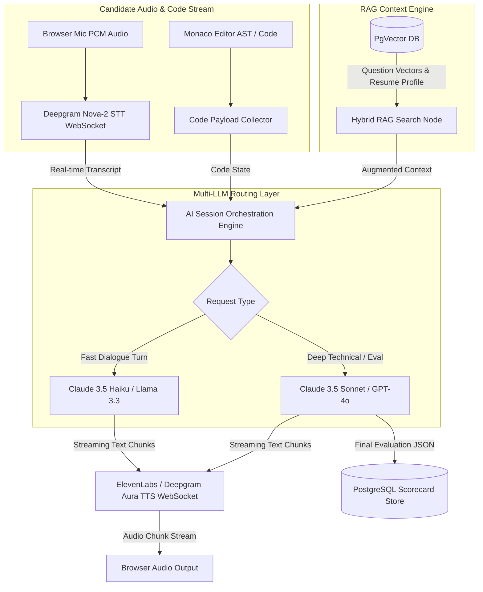
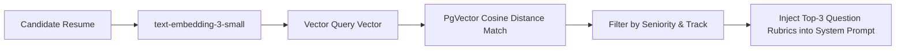

# InterviewGPT — AI & Audio Architecture Blueprint

## Executive Summary

The InterviewGPT AI engine operates as a hybrid, multi-model orchestration layer combining ultra-low-latency Speech-to-Text (STT), low-latency LLM streaming response generation, high-fidelity Text-to-Speech (TTS), and Retrieval-Augmented Generation (RAG) over candidate resume vectors.

---

## 1. High-Level AI System Architecture



---

## 2. Multi-LLM Orchestration & Routing Strategy

To balance low latency (<800ms full audio turn) with analytical depth during post-interview scorecards, InterviewGPT routes requests based on task complexity:

| Operation Task                          | Target LLM Model                | Latency Expectation | Rationale                                                              |
| :-------------------------------------- | :------------------------------ | :------------------ | :--------------------------------------------------------------------- |
| **Resume Entity Extraction**            | Claude 3.5 Sonnet               | < 2.5s              | Requires high-accuracy structured JSON parsing of complex PDF layouts. |
| **Target JD Match Index**               | OpenAI `text-embedding-3-small` | < 300ms             | Fast vector cosine distance calculation.                               |
| **Real-time Interview Question Turn**   | Claude 3.5 Haiku / GPT-4o-mini  | < 400ms TTFB        | Priority on instant response start for human speech flow.              |
| **Complex Technical Follow-up**         | Claude 3.5 Sonnet / GPT-4o      | < 700ms TTFB        | Required for verifying intricate code edge cases & system trade-offs.  |
| **Post-Session Multi-Pillar Scorecard** | Claude 3.5 Sonnet               | < 6.0s (Async)      | Deep reasoning over entire session transcript and code submissions.    |

---

## 3. Speech & Audio Processing Pipeline

### 3.1 Speech-to-Text (STT) Configuration

- **Engine**: Deepgram Nova-2 Streaming WebSocket API.
- **Sample Rate**: 16kHz PCM 16-bit mono.
- **Features**:
  - `smart_format=true` (Automatic punctuation & number formatting).
  - Custom Vocabulary Boost for technical keywords (`TypeScript`, `Kubernetes`, `GraphQL`, `PostgreSQL`, `Kafka`, `Microservices`).
  - Word-level timestamp metadata returned for WPM and filler word calculation.

### 3.2 Text-to-Speech (TTS) Configuration

- **Engine**: ElevenLabs Low-Latency Streaming WebSocket API (or Deepgram Aura).
- **Voice Tuning**: Professional, clear, warm voice profiles matching chosen interviewer persona.
- **Latency Optimization**: Stream response chunks as small as 3-5 words to begin audio synthesis immediately while the remaining text is generated by the LLM.

---

## 4. RAG Pipeline & Question Bank Synthesis



### Prompt Engineering & System Prompts

#### System Prompt Template (`TECHNICAL_INTERVIEWER_PERSONA`)

```markdown
SYSTEM PROMPT: You are a Staff Principal Engineer at a top-tier technology company conducting a 30-minute technical interview.

CANDIDATE CONTEXT:

- Candidate Name: {{candidate_name}}
- Target Role: {{target_role}} ({{seniority_level}})
- Uploaded Skills: {{candidate_skills}}

INTERVIEW RULES:

1. Conduct yourself professionally, attentively, and concisely.
2. Ask ONE clear question at a time. Do not overload the candidate with multi-part questions.
3. When the candidate provides code or technical answers, evaluate their solution against optimal time/space complexity.
4. If an answer is vague or lacks architectural trade-off discussions, ask a direct probing follow-up question.
5. NEVER reveal the answer or score mid-session.

OUTPUT FORMAT:
Return response in strictly formatted JSON:
{
"interviewer_dialogue": "Text spoken to candidate...",
"internal_evaluation_token": "Brief internal note on answer quality",
"difficulty_adjustment": "maintain | increase | decrease"
}
```

---

## 5. Cost Guardrails & Latency Optimization

1. **Session Token Budget Caps**:
   - Technical 30-min Session: Max **25,000 tokens** total prompt+completion across all turns.
   - If token budget reaches 85%, AI interviewer begins natural wrap-up sequence.
2. **Circuit Breakers & Model Fallbacks**:
   - Primary LLM timeout: 2.0 seconds. If breached, auto-fallback to secondary fast model.
   - If TTS streaming fails, fallback to browser native SpeechSynthesis API with UI warning.
3. **Structured Output Forcing**: Enforce JSON schema validation on all LLM responses to eliminate JSON parsing retries.
