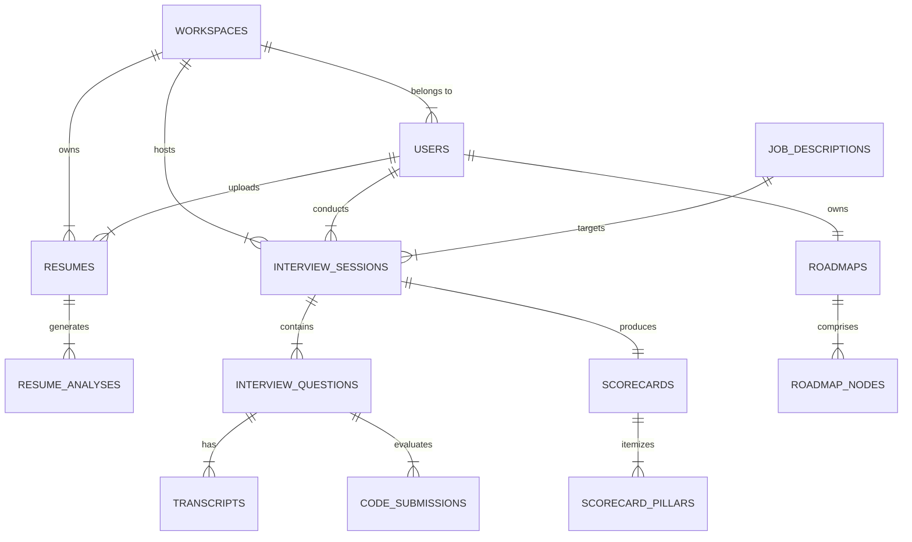

# InterviewGPT — Relational & Vector Database Architecture

## Executive Summary

InterviewGPT utilizes **PostgreSQL 16+** with the **`pgvector`** extension as its primary transactional and vector database engine, paired with **Redis 7+** for caching, rate limiting, and real-time WebSocket state management.

---

## 1. Database Entity Relationship Diagram (ERD)



---

## 2. Table Specifications & Entity Schema

### 2.1 Core Workspace & Identity

#### `workspaces`

Stores workspace tenant boundaries.

- `id` (UUID, Primary Key, DEFAULT `gen_random_uuid()`)
- `name` (VARCHAR(255), NOT NULL)
- `slug` (VARCHAR(100), UNIQUE, NOT NULL)
- `plan_tier` (VARCHAR(50), NOT NULL, DEFAULT `'free'`) -- `'free'`, `'pro'`, `'enterprise'`
- `created_at` (TIMESTAMPTZ, NOT NULL, DEFAULT `NOW()`)
- `updated_at` (TIMESTAMPTZ, NOT NULL, DEFAULT `NOW()`)

#### `users`

Stores user identity profile.

- `id` (UUID, Primary Key) -- References Auth Provider ID (Clerk/NextAuth)
- `workspace_id` (UUID, Foreign Key -> `workspaces.id`, NOT NULL)
- `email` (VARCHAR(255), UNIQUE, NOT NULL)
- `full_name` (VARCHAR(255), NOT NULL)
- `avatar_url` (TEXT)
- `role` (VARCHAR(50), NOT NULL, DEFAULT `'member'`) -- `'owner'`, `'member'`, `'admin'`
- `created_at` (TIMESTAMPTZ, NOT NULL, DEFAULT `NOW()`)

---

### 2.2 Resume & JD Vector Storage

#### `resumes`

Stores candidate uploaded resume raw metadata and parsed content.

- `id` (UUID, Primary Key, DEFAULT `gen_random_uuid()`)
- `workspace_id` (UUID, Foreign Key -> `workspaces.id`, NOT NULL)
- `user_id` (UUID, Foreign Key -> `users.id`, NOT NULL)
- `file_name` (VARCHAR(255), NOT NULL)
- `file_url` (TEXT, NOT NULL) -- S3 / Cloudflare R2 Object Storage URI
- `raw_text` (TEXT, NOT NULL)
- `parsed_profile` (JSONB, NOT NULL) -- Extracted Skills, Work History, Education
- `embedding` (vector(1536)) -- OpenAI `text-embedding-3-small` vector
- `is_active` (BOOLEAN, DEFAULT `true`)
- `created_at` (TIMESTAMPTZ, NOT NULL, DEFAULT `NOW()`)

#### `job_descriptions`

Target job postings for match calculations.

- `id` (UUID, Primary Key, DEFAULT `gen_random_uuid()`)
- `workspace_id` (UUID, Foreign Key -> `workspaces.id`, NOT NULL)
- `company_name` (VARCHAR(255), NOT NULL)
- `role_title` (VARCHAR(255), NOT NULL)
- `raw_description` (TEXT, NOT NULL)
- `required_skills` (JSONB, NOT NULL) -- Array of string keywords
- `embedding` (vector(1536))
- `created_at` (TIMESTAMPTZ, NOT NULL, DEFAULT `NOW()`)

---

### 2.3 Interview Sessions & Transcripts

#### `interview_sessions`

Core entity representing an active or completed mock interview.

- `id` (UUID, Primary Key, DEFAULT `gen_random_uuid()`)
- `workspace_id` (UUID, Foreign Key -> `workspaces.id`, NOT NULL)
- `user_id` (UUID, Foreign Key -> `users.id`, NOT NULL)
- `resume_id` (UUID, Foreign Key -> `resumes.id`, NULLABLE)
- `job_description_id` (UUID, Foreign Key -> `job_descriptions.id`, NULLABLE)
- `track` (VARCHAR(50), NOT NULL) -- `'technical'`, `'behavioral'`
- `seniority_level` (VARCHAR(50), NOT NULL) -- `'junior'`, `'mid'`, `'senior'`, `'staff'`
- `company_tier` (VARCHAR(50), NOT NULL) -- `'faang'`, `'startup'`, `'enterprise'`
- `status` (VARCHAR(50), NOT NULL, DEFAULT `'created'`) -- `'created'`, `'active'`, `'completed'`, `'cancelled'`
- `duration_seconds` (INTEGER, NOT NULL)
- `started_at` (TIMESTAMPTZ)
- `ended_at` (TIMESTAMPTZ)
- `created_at` (TIMESTAMPTZ, NOT NULL, DEFAULT `NOW()`)

#### `interview_questions`

Individual questions asked within a session.

- `id` (UUID, Primary Key, DEFAULT `gen_random_uuid()`)
- `session_id` (UUID, Foreign Key -> `interview_sessions.id`, NOT NULL)
- `sequence_order` (INTEGER, NOT NULL)
- `question_text` (TEXT, NOT NULL)
- `category` (VARCHAR(100), NOT NULL) -- `'algorithms'`, `'system_design'`, `'star_behavioral'`
- `difficulty` (VARCHAR(50), NOT NULL) -- `'easy'`, `'medium'`, `'hard'`
- `ideal_rubric` (JSONB, NOT NULL) -- Keywords, key concepts, trade-off points
- `created_at` (TIMESTAMPTZ, NOT NULL, DEFAULT `NOW()`)

#### `transcripts`

Voice/text turns between candidate and AI interviewer.

- `id` (UUID, Primary Key, DEFAULT `gen_random_uuid()`)
- `question_id` (UUID, Foreign Key -> `interview_questions.id`, NOT NULL)
- `speaker` (VARCHAR(20), NOT NULL) -- `'interviewer'`, `'candidate'`
- `content` (TEXT, NOT NULL)
- `audio_url` (TEXT, NULLABLE) -- Discarded or kept based on user privacy setting
- `words_per_minute` (FLOAT)
- `filler_word_count` (INTEGER, DEFAULT 0)
- `filler_words_detected` (JSONB) -- `{"um": 3, "like": 2}`
- `pause_count` (INTEGER, DEFAULT 0)
- `timestamp_ms` (BIGINT, NOT NULL)
- `created_at` (TIMESTAMPTZ, NOT NULL, DEFAULT `NOW()`)

#### `code_submissions`

Monaco sandbox execution attempts.

- `id` (UUID, Primary Key, DEFAULT `gen_random_uuid()`)
- `question_id` (UUID, Foreign Key -> `interview_questions.id`, NOT NULL)
- `language` (VARCHAR(50), NOT NULL) -- `'typescript'`, `'python'`, `'go'`, `'java'`
- `code_content` (TEXT, NOT NULL)
- `execution_status` (VARCHAR(50), NOT NULL) -- `'passed'`, `'failed'`, `'error'`
- `stdout` (TEXT)
- `stderr` (TEXT)
- `runtime_ms` (INTEGER)
- `created_at` (TIMESTAMPTZ, NOT NULL, DEFAULT `NOW()`)

---

### 2.4 Scorecards & Roadmaps

#### `scorecards`

Aggregated post-session candidate evaluations.

- `id` (UUID, Primary Key, DEFAULT `gen_random_uuid()`)
- `session_id` (UUID, Foreign Key -> `interview_sessions.id`, UNIQUE, NOT NULL)
- `overall_score` (NUMERIC(4, 1), NOT NULL) -- e.g. 84.5 (out of 100)
- `technical_depth_score` (NUMERIC(4, 1), NOT NULL)
- `communication_score` (NUMERIC(4, 1), NOT NULL)
- `problem_solving_score` (NUMERIC(4, 1), NOT NULL)
- `behavioral_star_score` (NUMERIC(4, 1), NOT NULL)
- `summary_feedback` (TEXT, NOT NULL)
- `key_strengths` (JSONB, NOT NULL) -- Array of string summaries
- `critical_weaknesses` (JSONB, NOT NULL) -- Array of string summaries
- `created_at` (TIMESTAMPTZ, NOT NULL, DEFAULT `NOW()`)

#### `roadmaps` & `roadmap_nodes`

Personalized career skill trees.

- `roadmaps`: `id`, `user_id`, `created_at`, `updated_at`
- `roadmap_nodes`: `id`, `roadmap_id`, `title`, `description`, `category`, `status` (`'todo'`, `'in_progress'`, `'mastered'`), `priority` (`'high'`, `'medium'`, `'low'`), `source_scorecard_id`

---

## 3. Vector Storage & Search Strategy

### 3.1 `pgvector` HNSW Index Specification

Hierarchical Navigable Small World (HNSW) indices are created on embedding columns to ensure sub-50ms similarity searches across 1,000,000+ question bank & resume records.

```sql
-- Create pgvector extension
CREATE EXTENSION IF NOT EXISTS vector;

-- Create HNSW index for resume embeddings using cosine distance
CREATE INDEX idx_resumes_embedding_hnsw
ON resumes
USING hnsw (embedding vector_cosine_ops)
WITH (m = 16, ef_construction = 64);

-- Create HNSW index for job description embeddings
CREATE INDEX idx_job_descriptions_embedding_hnsw
ON job_descriptions
USING hnsw (embedding vector_cosine_ops)
WITH (m = 16, ef_construction = 64);
```

---

## 4. Indexing & Optimization Strategy

| Table                | Index Name                 | Type   | Columns Indexed                        | Purpose                                        |
| :------------------- | :------------------------- | :----- | :------------------------------------- | :--------------------------------------------- |
| `users`              | `idx_users_workspace`      | B-Tree | `workspace_id`, `email`                | Fast user lookup within workspace.             |
| `interview_sessions` | `idx_sessions_user_status` | B-Tree | `user_id`, `status`, `created_at DESC` | Instant user dashboard session history.        |
| `transcripts`        | `idx_transcripts_question` | B-Tree | `question_id`, `sequence_order ASC`    | Replaying transcripts in sequential order.     |
| `resumes`            | `idx_resumes_parsed_gin`   | GIN    | `parsed_profile jsonb_path_ops`        | Fast JSON query filtering on candidate skills. |

---

## 5. Multi-Tenancy & Security Policies (Row Level Security - RLS)

To strictly enforce multi-tenant workspace security and prevent cross-tenant data access:

```sql
-- Enable RLS on core tables
ALTER TABLE resumes ENABLE ROW LEVEL SECURITY;
ALTER TABLE interview_sessions ENABLE ROW LEVEL SECURITY;

-- Tenant Isolation Policy example for interview_sessions
CREATE POLICY workspace_isolation_policy ON interview_sessions
    FOR ALL
    USING (workspace_id = NULLIF(current_setting('app.current_workspace_id', true), '')::uuid);
```
