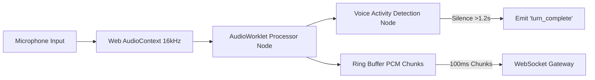

# InterviewGPT — UI Architecture Blueprint

## Executive Summary

The InterviewGPT UI is designed for extreme performance, clean layout density, and zero latency friction. Inspired by **Linear**, **Vercel**, and **Raycast**, the web client is constructed using **Next.js App Router (React Server Components)**, **Zustand** for transient audio & session state, **Monaco Editor** for coding sandboxes, and **TailwindCSS / Vanilla CSS Tokens** for styling.

---

## 1. High-Level Component & Routing Hierarchy

```
app/
├── (auth)/
│   ├── login/
│   └── signup/
├── (dashboard)/
│   ├── layout.tsx                # Main App Shell (Sidebar, Command Bar, User Profile)
│   ├── page.tsx                  # Candidate Overview & Metric Widgets
│   ├── resumes/
│   │   ├── page.tsx              # Resume Intelligence & Upload Portal
│   │   └── [id]/page.tsx          # Resume Detail & Target JD Match Analysis
│   ├── interviews/
│   │   ├── page.tsx              # Session Configurator & History List
│   │   └── [id]/
│   │       ├── live/page.tsx     # Active Audio / Monaco IDE Live Room (Client Component)
│   │       └── scorecard/page.tsx# Post-Interview Scorecard & Diagnostic Report
│   └── roadmap/
│       └── page.tsx              # Interactive Skill Gap Tree Node Graph
└── api/                          # Edge API Proxy Handlers
```

---

## 2. Server Components vs. Client Components Strategy

To achieve sub-1.2s LCP and instant page transitions, InterviewGPT strictly separates static server rendering from client interactivity:

```
┌─────────────────────────────────────────────────────────────────┐
│ Server Components (RSC) — 80% of Bundle                         │
│ • Layout Shell & Navigation Headers                             │
│ • Database queries (TanStack Query Initial Data)                │
│ • Static Scorecard Summaries & Historical Charts                │
│ • Markdown & Rubric Rendering                                   │
└─────────────────────────────────────────────────────────────────┘
                                │
                                ▼ Passes props & initial data
┌─────────────────────────────────────────────────────────────────┐
│ Client Components (RCC) — 20% of Bundle (Lazy-Loaded)           │
│ • Live Interview Room (`/interviews/[id]/live`)                 │
│ • `AudioStreamController` (Microphone Web Audio API & VAD)       │
│ • `MonacoCodeEditor` (Lazy-loaded code sandbox)                 │
│ • `CommandKPalette` (Global hotkey overlay)                     │
│ • `InteractiveWaveform` (Canvas audio visualizer)               │
└─────────────────────────────────────────────────────────────────┘
```

---

## 3. State Management Matrix

InterviewGPT uses a strict 3-tier state model to avoid unnecessary re-renders during high-frequency audio turn-taking:

| State Tier                  | Technology        | Use Case                                                                                                   | Lifecycle Scope                                  |
| :-------------------------- | :---------------- | :--------------------------------------------------------------------------------------------------------- | :----------------------------------------------- |
| **Server Cache State**      | TanStack Query v5 | User profile, historical scorecards, list of resumes, roadmap node statuses.                               | Persisted & invalidated via mutation keys.       |
| **Transient Session State** | Zustand           | Active WebSocket connection status, current interview question index, audio volume metrics, live captions. | Active interview session only (cleared on exit). |
| **URL Search Param State**  | `nuqs`            | Filter states (e.g. `?track=technical&status=completed`), pagination, drawer open states.                  | Shareable & bookmarkable.                        |

---

## 4. Audio & Media Capture Engine (`useAudioStream` Hook Architecture)

The live interview room uses a dedicated Web Audio API pipeline built with `AudioWorklet` for low-latency PCM 16-bit encoding:



### Custom Hook API Contract (`useAudioStream.ts`)

```typescript
interface UseAudioStreamOptions {
  sessionId: string;
  wsUrl: string;
  onTranscriptReceived: (transcript: LiveCaptionPayload) => void;
  onInterviewerAudioChunk: (chunk: ArrayBuffer) => void;
  onTurnComplete: () => void;
}

interface UseAudioStreamReturn {
  isRecording: boolean;
  isInterviewerSpeaking: boolean;
  inputVolumeLevel: number; // 0.0 to 1.0 for visualizer
  startAudioStream: () => Promise<void>;
  stopAudioStream: () => void;
  toggleMute: () => void;
}
```

---

## 5. Command Palette (`⌘ + K`) & Keybinding Architecture

InterviewGPT features a Raycast/Linear-grade Command Menu powered by `cmdk`. It listens for global keydown events anywhere in the workspace.

### Keybinding Registry Matrix

| Key Combo        | Action                                | Scope                       |
| :--------------- | :------------------------------------ | :-------------------------- |
| `⌘ + K`          | Toggle Global Command Palette Overlay | Global                      |
| `⌘ + I`          | Start New Quick Mock Interview        | Global                      |
| `⌘ + R`          | View Current Career Roadmap           | Global                      |
| `⌘ + Enter`      | Execute Monaco Code Sandbox           | Live Interview (Code Mode)  |
| `Space` _(Hold)_ | Push-to-Talk Override                 | Live Interview (Audio Mode) |
| `Esc`            | Mute Mic / Close Overlay              | Live Interview / Overlays   |

---

## 6. Performance Budget & Core Web Vitals Targets

To ensure the interface feels instantaneous:

1. **Bundle Size Limit**: First Load JS < **70kB** gzipped.
2. **Lazy Loading**: Monaco Editor and Canvas Visualizers must be imported dynamically (`next/dynamic` with `ssr: false`).
3. **Core Web Vitals Enforcements**:
   - **Largest Contentful Paint (LCP)**: < **1.2s** (Optimized font preloading, critical CSS inline).
   - **Interaction to Next Paint (INP)**: < **50ms** (Zero blocking JavaScript on main thread).
   - **Cumulative Layout Shift (CLS)**: **0.00** (All dynamic cards use skeleton placeholders with fixed dimensions).
