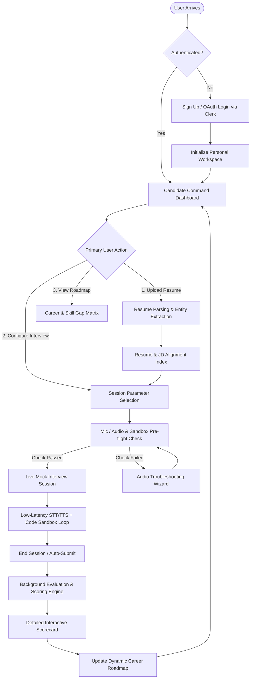
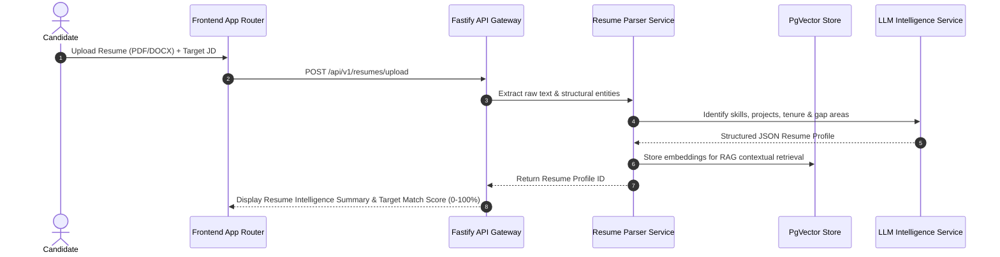
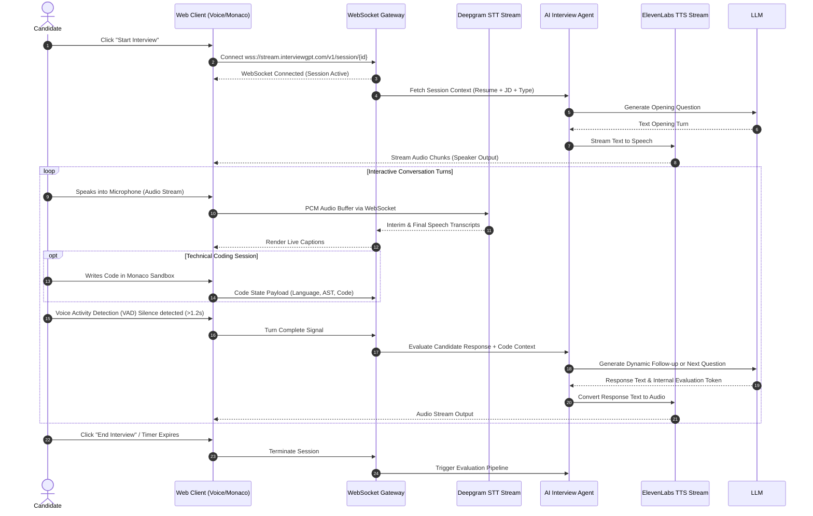
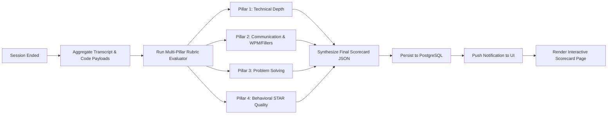
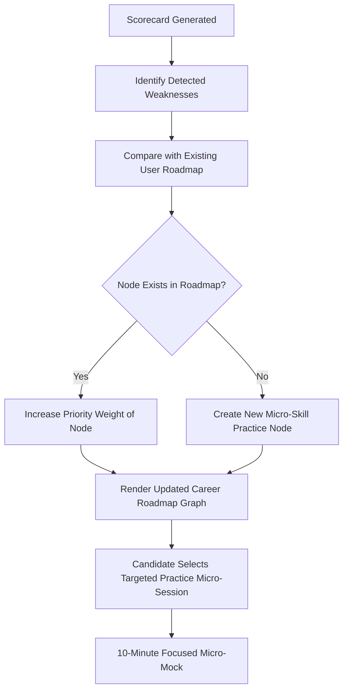

# InterviewGPT — User Flow Architecture

## Overview

InterviewGPT prioritizes low-friction, high-velocity user journeys. Candidates move seamlessly from onboarding to interactive mock sessions, instant performance scorecards, and personalized practice roadmaps.

---

## 1. Global System Flowchart

---

## 2. Detailed User Flow Breakdowns

### 2.1 Resume & Target JD Intelligence Flow

---

### 2.2 Live Mock Interview Execution Loop

---

### 2.3 Post-Session Evaluation & Scorecard Flow

---

### 2.4 Skill Gap & Roadmap Generation Loop

---

## 3. Failure & Edge Case Handling Flows

### 3.1 Network Disconnection / WebSocket Drop

1. **Client Detection**: Client detects WebSocket close event (`code != 1000`).
2. **UI State**: Instant banner: _"Reconnecting to interview stream... Session paused."_
3. **Auto-Retry**: Exponential backoff reconnection algorithm (1s, 2s, 4s, max 10s).
4. **State Recovery**: Upon reconnection, Server sends state snapshot containing last transcript turn and timer offset.

### 3.2 Audio Permission Denied / Browser Failure

1. **Pre-flight Check**: System runs browser mic check before entering live room.
2. **Fallback Mode**: If mic access is refused or unsupported, system offers **Keyboard Text Mode** with explicit prompt warning candidate that communication telemetry (WPM/filler words) will be disabled.

### 3.3 LLM API Rate Limit / Provider Failure

1. **Primary Circuit Breaker**: If Anthropic Sonnet times out (>2.5s), request automatically shifts to OpenAI GPT-4o.
2. **Secondary Fallback**: If secondary LLM fails, shift to high-throughput backup model (Llama 3.3 / Groq).
3. **Candidate Experience**: Zero session crash; slight response delay with status badge: _"Synthesizing follow-up..."_
